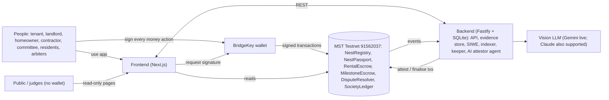
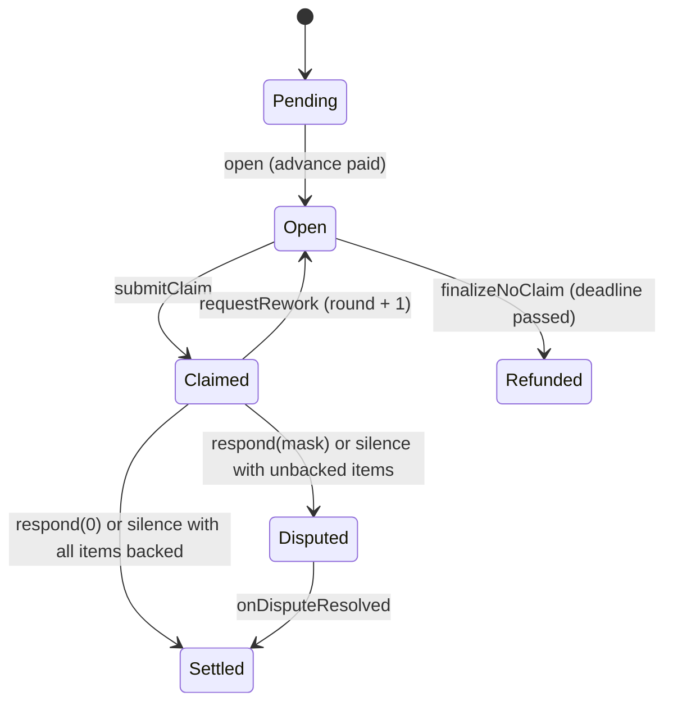

# NestLedger

**The trust layer for home living.** Rent deposits, society maintenance funds and home renovation budgets sit in smart contracts on MST Blockchain, not in the landlord's, committee's or contractor's account. An AI attestor agent checks the photos and invoices, and humans decide every contested rupee.

   

Built at the MST Blockchain × Newrro Buildathon (28–29 Sep 2026). The full spec is in [docs/SPEC.md](docs/SPEC.md), and every deviation from it is listed in [docs/SPEC-CHANGES.md](docs/SPEC-CHANGES.md).

---

## Contents

1. [Problem and solution](#problem-and-solution)
2. [Live links](#live-links)
3. [How it works](#how-it-works)
4. [MST integration](#mst-integration)
5. [The AI attestor](#the-ai-attestor)
6. [Security and privacy](#security-and-privacy)
7. [Judge guide](#judge-guide)
8. [Setup](#setup)
9. [Limitations and roadmap](#limitations-and-roadmap)
10. [Acknowledgements](#acknowledgements)

---

## Problem and solution

In Bengaluru, almost every large payment around a home is made on blind trust, and the party holding the money has no reason to be fair.

- **Deposits.** Tenants hand over 6–10 months' rent as a deposit, held entirely by the landlord. At move-out, deductions are arbitrary and refunds take months.
- **Society funds.** Apartment associations collect lakhs every month in maintenance, with no visibility into how it's spent. Inflated vendor bills go unchallenged.
- **Renovations.** Homeowners pay contractors large advances. When work stalls or the contractor vanishes, they have no leverage once the money is gone.

The pattern is the same each time: one interested party holds the money, there's no neutral record of what was agreed or delivered, and the only recourse is a legal fight that costs more than the amount at stake.

**NestLedger's rule is that no home-related money moves until the agreed condition is met and verified.** The money sits in contracts on MST Testnet. An AI agent with its own wallet reads the evidence and writes a hashed verdict on-chain, but that verdict never moves money on its own. It only decides whether *silence counts as consent*. The payer, a society committee or a panel of three arbiters makes every contested decision, and the contract pays out the result. Every participant builds a non-transferable **NestPassport**, so good tenants pay smaller deposits.

### One primitive, three products

> payee claims itemised amounts → AI attests how much of each item the evidence supports → payer accepts or disputes per item → silence pays the AI-backed items and escalates the rest → arbiters rule per item → the contract pays out

| Product | Payer (can object) | Payee (claims) | What gets claimed |
|---|---|---|---|
| **DepositLock** (rent) | Tenant | Landlord | Unpaid rent + damage deductions from the deposit |
| **BuildSafe** (renovation; built and tested, not in the live demo) | Homeowner or society treasury | Contractor | A milestone's line items, each with a materials advance |
| **SocietyLedger** (society funds) | Society treasury, via committee and resident votes | Vendor | An invoice, AI-extracted and anomaly-checked, with approvals that scale with risk |

---

## Live links

The demo runs from a team laptop behind Cloudflare quick tunnels ([docs/HOSTING.md](docs/HOSTING.md)). **Tunnel URLs change when the tunnels restart**, and this section is updated when they do.

| What | Link | Wallet needed? |
|---|---|---|
| App | https://stack-bikes-invitation-arms.trycloudflare.com | For actions only |
| Public society dashboard | https://stack-bikes-invitation-arms.trycloudflare.com/public/society/1 | No |
| A tenant's passport (ASHA) | https://stack-bikes-invitation-arms.trycloudflare.com/passport/0x6d7B1fB983c8fa39F98e9e12cBe5c1a5694eD685 | No |
| System status (chain, backend, contracts, demo cast) | https://stack-bikes-invitation-arms.trycloudflare.com/status | No |
| Backend health | https://lying-weekends-decent-born.trycloudflare.com/health | No |
| Demo video | *added at submission* | |

---

## How it works

### Architecture



Humans sign every money action with BridgeKey. The backend has two server wallets:

- **AGENT** attests evidence.
- **KEEPER** triggers timeouts once a deadline passes.

Neither can move funds anywhere a contract rule doesn't already send them.

### The core primitive (`AttestedEscrow`)

`RentalEscrow` and `MilestoneEscrow` both inherit the abstract `AttestedEscrow`. Each agreement holds one or more *tranches*:



- **Settled:** the payee gets max(awarded, advance) and the payer gets the rest.
- **Disputed:** undisputed items are paid at once, and only the disputed items stay frozen.

### Design rules every module follows

1. Money never sits with an interested party. It sits in a contract.
2. The AI never moves money alone. It only decides whether silence counts as consent, and whether a society bill needs more approvals.
3. Every waiting state has a deadline, and every deadline has a default that favours whoever acted on time.
4. Undisputed money moves immediately. Disputes are itemised, and arbiters rule per line item.
5. Whoever documents first sets the baseline, and the other side gets a fixed window to contest it.
6. There is no admin path to user funds. Admins can pause *new* agreements, never exits.
7. Private evidence stays off-chain. Only hashes go on-chain. Society invoices are public on purpose.
8. Everything a judge sees is real, and every step in the UI links to its MSTScan transaction.

### Repository layout

| Path | What |
|---|---|
| `packages/contracts` | Hardhat project: 6 contracts + the `AttestedEscrow` core, 61 tests, deploy / verify / actor scripts |
| `packages/shared` | `@nestledger/shared`: chain config, ABIs + addresses, money helpers, hashing, enums, time windows, zod schemas |
| `packages/backend` | Fastify API, SQLite, evidence store, SIWE, indexer, keeper, AI tasks + agent, seed script (51 tests) |
| `packages/frontend` | Next.js app (App Router), wagmi + viem, BridgeKey connect, every page in SPEC §8.3 |
| `docs/` | Spec, spec changes, work split, hosting, demo cast, demo script |

---

## MST integration

### Chain configuration

| Field | Value |
|---|---|
| Network | MST Testnet |
| Chain ID | `91562037` (`0x5752035`) |
| RPC | `https://testnetrpc.mstblockchain.com` |
| Currency | tMSTC (18 decimals). Every on-chain amount is wei of native tMSTC; there are no ERC-20s |
| Explorer | https://testnet.mstscan.com |
| Faucet | https://faucet.masterstroke.academy |

The same config is in [`packages/shared/src/chain.ts`](packages/shared/src/chain.ts): viem `defineChain`, explorer link helpers, and the `wallet_addEthereumChain` parameters.

### Contracts (testnet v2, all verified on MSTScan)

Deployed from block `5796145` by `0x6410E1fE8066A5d28af8c4A23edB4Bb788519214` (ADMIN).

| Contract | Role | Address |
|---|---|---|
| **RentalEscrow** | DepositLock: leases, rent split, baseline, move-out, deposit claims | [`0x9C545aB0b33d7707E8725974eB6285AE64855A9C`](https://testnet.mstscan.com/address/0x9C545aB0b33d7707E8725974eB6285AE64855A9C) |
| **MilestoneEscrow** | BuildSafe (deployed and tested; not in the live demo): milestones, advances, rework rounds, change orders, stall rule | [`0xb617d533479eeC236399C0874a42CCcce70b526F`](https://testnet.mstscan.com/address/0xb617d533479eeC236399C0874a42CCcce70b526F) |
| **SocietyLedger** | Society treasury: maintenance, tiered proposals, resident votes, AI invoice checks | [`0x8f33F06C739DeafbDb043854F693935Eb244c1C0`](https://testnet.mstscan.com/address/0x8f33F06C739DeafbDb043854F693935Eb244c1C0) |
| **DisputeResolver** | 3-arbiter panels, per-item votes, dispute bond | [`0xfee1810E16AdC5A4348Ba018Cfc439f5fCCBabB1`](https://testnet.mstscan.com/address/0xfee1810E16AdC5A4348Ba018Cfc439f5fCCBabB1) |
| **NestPassport** | Soulbound reputation: 22 stats, tenant tiers, trust-priced deposits | [`0x2cf688D321e886861BD0B780e0878017EcA2B98A`](https://testnet.mstscan.com/address/0x2cf688D321e886861BD0B780e0878017EcA2B98A) |
| **NestRegistry** | Users, roles, verification, module and attestor roles | [`0x5212a77a5b2bCAC1087442E6e2Bd6f8E20D066F8`](https://testnet.mstscan.com/address/0x5212a77a5b2bCAC1087442E6e2Bd6f8E20D066F8) |

The same addresses are exported from [`packages/shared/src/addresses.ts`](packages/shared/src/addresses.ts), and the ABIs from [`packages/shared/src/abis/`](packages/shared/src/abis/).

- **Wiring:** MODULE_ROLE goes to the four modules, ATTESTOR_ROLE to AGENT, and arbiters ARB1–3 are added.
- **Demo parameters:** tenant tiers need 2 on-time payments, the dispute bond is 0.001 tMSTC, and the arbiter voting window is 300 s.

The spec also planned **TankerTrust** (IoT water deliveries). The team dropped it during the event, and its interface stays in `contracts/interfaces/` because Appendix A was frozen (see SPEC-CHANGES).

### Transactions by type

All real, all on MST Testnet, on the final deployment. The *Signed by* column shows who sent each one:

- **Scripted:** demo-cast keys used by the seed script (`packages/backend/scripts/seed.ts`).
- **BridgeKey:** a person clicking in the app during the team's dry run.
- **AGENT / KEEPER:** the backend's two server wallets.

| # | Type (function) | Contract | Signed by | Transaction |
|---|---|---|---|---|
| 1 | `register` (mints the soulbound passport) | NestRegistry | MEERA (scripted) | [`0x4adf…48e1`](https://testnet.mstscan.com/tx/0x4adf248bbd8303683906621183a6575d06781241cd1dc449b70cdfb4eded48e1) |
| 2 | `verify` | NestRegistry | ADMIN | [`0x4ec8…37aa`](https://testnet.mstscan.com/tx/0x4ec83a2eb6d5238bb2f986f97582d24d868e5ab748769e9e9cba1a20b66e37aa) |
| 3 | `addArbiter` | DisputeResolver | ADMIN | [`0x482c…593d`](https://testnet.mstscan.com/tx/0x482c74e79c580e8d94a14fa91c9bb21203ac98ec53e3e0e23e61b264bc3f593d) |
| 4 | `setTierParams` | NestPassport | ADMIN | [`0x1b2b…ce83`](https://testnet.mstscan.com/tx/0x1b2b24ebedbef367e20f9140f2cf5095f47fa7f23e8920250d44e8739222ce83) |
| 5 | `createSociety` (Green Meadows Residency) | SocietyLedger | MEERA (scripted) | [`0xc9cb…6f0c`](https://testnet.mstscan.com/tx/0xc9cbdaf43556734d1f50e4530ea121a3d3ab183326446858603366a52c006f0c) |
| 6 | `addFlat` (A-101) | SocietyLedger | MEERA (scripted) | [`0xbd70…a34d`](https://testnet.mstscan.com/tx/0xbd706f7f7fe024df59b35c8978d67c5265e81bdad732e754b74122983d5fa34d) |
| 7 | `payMaintenance` | SocietyLedger | PRIYA (scripted) | [`0x21ae…06fe`](https://testnet.mstscan.com/tx/0x21ae21c5608e77af14bd8305d4a62cb54c4d2741e0812946176d8c896bdf06fe) |
| 8 | `propose` (PayVendor, ₹1,200 plumbing invoice) | SocietyLedger | MEERA (scripted) | [`0x6094…c9be`](https://testnet.mstscan.com/tx/0x6094576ccaf8465c996107f1dd7ebfb6742fd880ca0fdfcf3ea7eb069dccc9be) |
| 9 | `attestInvoice` (Gemini read the invoice: risk 0, clean) | SocietyLedger | **AGENT** | [`0xeb37…2b66`](https://testnet.mstscan.com/tx/0xeb37eb11d45a1b974b225db71a6e0a3609fefa3519643a16d027305e329e2b66) |
| 10 | `execute` (pays the vendor) | SocietyLedger | **KEEPER** | [`0x0bad…a7de`](https://testnet.mstscan.com/tx/0x0bad656b14e95b883999c0ad07867aa35bf76477bd279c7242a870a8269da7de) |
| 11 | `offerLease` | RentalEscrow | ROHAN (scripted) | [`0x4ae7…0b56`](https://testnet.mstscan.com/tx/0x4ae71eb15a2bfdbc98ddd381863f7f31b0646e9cc2de3286565a0b7a87740b56) |
| 12 | `signLease` (**deposit locked**, ₹1,80,000) | RentalEscrow | ASHA (scripted) | [`0xf8e9…74eb`](https://testnet.mstscan.com/tx/0xf8e9db5bc90c044c5070b79fb9ca7aa0080ec4c84c3c7043441265b3ed5374eb) |
| 13 | `payRent` (rent → landlord, maintenance → society) | RentalEscrow | ASHA (scripted) | [`0xf9ca…42cc`](https://testnet.mstscan.com/tx/0xf9ca44f894241f5088a0cc6869708547d42dfbc8a0f30a2c3ddfd32ede7842cc) |
| 14 | `submitBaseline` (move-in photos hash + AI move-in report) | RentalEscrow | ASHA (scripted) | [`0x2997…5ab8`](https://testnet.mstscan.com/tx/0x299764a456c68e612839c3cdad73210f92c62968673b0b18b7e1f9be6ff55ab8) |
| 15 | `finalizeBaseline` (landlord silent → presumed accepted) | RentalEscrow | **KEEPER** | [`0x3d85…6dca`](https://testnet.mstscan.com/tx/0x3d852fd555e64b80dbe8780093bcc70b2b691ffb2ab98ac9d994ea8214416dca) |
| 16 | `startMoveOut` (move-out photos; Gemini found the cracked tile) | RentalEscrow | ASHA (BridgeKey) | [`0x796d…8e25`](https://testnet.mstscan.com/tx/0x796d504b1c1881cf97c3f6edb9dcde27cb6ab72b60f4e89e06383c88bb678e25) |
| 17 | `submitClaim` (₹450 tile deduction) | RentalEscrow | ROHAN (BridgeKey) | [`0x750c…b422`](https://testnet.mstscan.com/tx/0x750cc633298ccf1f75052ab08c62b2176377dd2bdedb219fb83be5715dc5b422) |
| 18 | `attest` (AI backs the ₹450, 3 s after the claim) | RentalEscrow | **AGENT** | [`0x112b…7291`](https://testnet.mstscan.com/tx/0x112bf394c3a494b21b957fbc56dbfa90e1433d830ab91682f55bfad636187291) |
| 19 | `respond(0)` (tenant accepts: ₹450 to landlord, ₹1,79,550 back to tenant, lease closed, passport → Tier 3) | RentalEscrow | ASHA (BridgeKey) | [`0x2017…b3bd`](https://testnet.mstscan.com/tx/0x2017e144496ed6065d847a53eebcfc26f36a35f61be02264624d6d4a7260b3bd) |

The live demo adds a greedy claim with an unbacked item, `respond(mask)` (itemised dispute), arbiter `vote`s, a trust-priced `offerLease` and a flagged `attestInvoice` with override `approve`s. The deployment already holds 88 transactions; the full list is on each contract's MSTScan page.

### BridgeKey

BridgeKey is the only wallet the app asks for ([`ConnectBridgeKey`](packages/frontend/src/components/ConnectBridgeKey.tsx)):

- **Connect:** picks the EIP-6963 provider whose name contains "BridgeKey", falls back to `window.ethereum`, and shows install links if neither exists.
- **Network guard:** `wallet_switchEthereumChain` to `0x5752035`. On error 4902 it calls `wallet_addEthereumChain` with the shared parameters.
- **Sign-in:** SIWE (`personal_sign`) with chain ID 91562037, which gets a JWT for the backend's private evidence.
- **Every money action is a BridgeKey signature:** register, sign lease, pay rent, submit baseline, move-out, claim, respond or dispute, vote, propose, approve with override reason, create project, accept, and more. Each goes through one `useTx` hook, which shows a toast with the MSTScan link.

### Vibe Kit

The repo was scaffolded with the official MST Vibe Kit (`create-mst-app --template blank`). We kept its turbo pipeline, workspace scripts, Hardhat network config (`testnet` = 91562037), the deploy and verify script pattern, and its same-origin RPC proxy (`/api/rpc/testnet`), which the frontend needs because the MST RPC sends no CORS headers.

### MST SDK

The spec planned to use `@mstblockchain/mst-sdk` for the backend's gas drip and health checks. **We didn't end up using it.** The backend uses ethers v6 (`JsonRpcProvider` + `Wallet`) against the MST RPC for the gas drip, `getBlockNumber` and `getBalance`, and the frontend uses viem/wagmi. The SDK is still listed in the frontend's dependencies from the Vibe Kit template but isn't imported.

---

## The AI attestor

**What it does.** The backend runs one agent with its own wallet (AGENT, `ATTESTOR_ROLE`). It watches the indexer for new claims and proposals, runs a vision task, stores the full JSON report, and posts the report's hash and per-item backing on-chain:

| Task | Input | Output on-chain |
|---|---|---|
| Move-in / move-out comparison | Room photos from the same vantage points, before and after | Per claim item: supported amount, overall score, report hash |
| Milestone check | Contractor's site photos vs the design reference images | Per line item: supported fraction × cap, match score |
| Invoice check | Invoice photo + the society's payment history | Risk score 0–100, flagged or not, report hash |

- **Numbers come from code; words come from the LLM.** The model classifies (new damage vs normal wear, complete vs partial) and picks rate-card items. Code computes every rupee, cap and threshold.
- **Normal wear is always ₹0.**
- **Invoice anomaly rules R1–R7 are deterministic.** They are price vs the category median, vendor month-to-date spend, duplicate invoice numbers, and so on. The LLM only writes the one-line justification.
- **Integrity checks run on every upload:** keccak duplicates, perceptual-hash reuse detection, photo freshness, EXIF time and a 200 m geofence.
- **Fail-safe:** reused or stale photos, low confidence (< 0.6) or invalid output all mean zero support. Nothing is backed, and humans decide.

**What it can't do.** It can't move money.

- **Rent and renovation claims:** a backed item is paid only if the payer stays silent. Anything the payer disputes goes to three human arbiters.
- **Society bills:** a flag only raises the approval tier and resets approvals. Each committee member must then write an override reason, which is published on the public dashboard.

**Live model in the demo: Google Gemini (`gemini-3.5-flash`).** Every report the demo shows comes from a real vision-model call, stored with its hash, and the UI badge names the model. `LLM_PROVIDER=anthropic` switches to Claude. `LLM_PROVIDER=fixtures` returns recorded outputs from `packages/backend/src/ai/fixtures/` (labelled "AI: fixture mode") and is the fallback if the model API is down; the integrity checks, rules and on-chain attestations still run.

**Prepared images in the demo (demo mode).** We can't crack a tile at the venue, so the demo flats use AI-generated room photos, visibly stamped "AI-generated demo image" (`demo-photos/`), uploaded through the capture wizard instead of the live camera. The backend runs with `DEMO_UPLOADS=1`: an uploaded photo isn't rejected just for lacking a camera timestamp, but reuse and duplicate checks still apply, and every such photo carries an "Uploaded — not live camera" badge. Without the flag (production), only live camera shots can earn AI backing. Each demo lease has its own image set (`demo-photos/set-1..4`), so no lease's photos look reused against another's.

---

## Security and privacy

**Contracts**
- Solidity 0.8.24, OpenZeppelin 5.0 (`AccessControl`, `ReentrancyGuard`, `Pausable`), and custom errors.
- `nonReentrant` on every state-changing function, following checks → effects → interactions.
- **Pull-payment fallback:** a failing recipient never blocks a settlement. Its payout moves to `withdrawable`, and the recipient claims it with `withdraw()`.
- **No admin fund path:** no role can move escrowed money outside the contract rules, and a test asserts it. Pausing only stops *new* leases, projects, societies and proposals, so money can always leave.
- **Bounded loops:** at most 10 claim items and 12 milestones, and committees of 1–5.
- **Reputation can't be edited:** passport stats are written only by registered modules, from real flows. When a seed-ordering bug recorded a wrong late payment, we redeployed rather than edit it (SPEC-CHANGES).

**Evidence and privacy (N9)**
- Only hashes go on-chain. Photos and reports live in the backend's content-addressed store.
- Files are readable only by the parties, their assigned arbiters and the agent (SIWE + JWT). No names go on-chain.
- Society invoices and AI invoice reports are public on purpose. That's the point of the treasury.

**Server wallets**
- AGENT can only attest.
- KEEPER can only call functions that anyone may call once a deadline passes, and it dry-runs every call with `staticCall` first.
- Their keys live only in the backend's `.env.local`, which is never committed.

---

## Judge guide

### No wallet needed

- **`/public/society/1`:** Green Meadows Residency's treasury. It shows the balance, collections vs spending, and every payout with its invoice image, AI risk score, approvers, override reasons and MSTScan link.
- **`/passport/<address>`:** anyone's soulbound reputation, for example ASHA's (link above).
- **`/status`:** chain and block, backend health, indexer lag, AI mode, all contracts, and the demo-cast wallets with live balances.

### With BridgeKey

1. Install BridgeKey and open the app. **Connect BridgeKey** adds and switches to MST Testnet for you.
2. Get tMSTC from the faucet: https://faucet.masterstroke.academy
3. Go to **`/onboard`**, pick a role and register. This mints your passport. After registering, the app sends a small gas top-up once.
4. Try it:
   - `/rent/new`: offer a lease to a second wallet of yours (trust pricing shows the tier-based deposit).
   - `/build/new`: create a milestone project.
   - `/society/new`: create your own society.

   Each step links to its transaction on MSTScan.
5. **Want to see a finished flow?** Lease `/rent/1` (ROHAN → ASHA) went through move-out, an AI-backed claim and settlement in our dry run, and society `/society/1` has three AI-checked plumbing payouts. Anyone can read them; only their parties can act. Leases `/rent/2`–`/rent/4` (tenants PRIYA, IMRAN, C5) are staged for live demos.

Demo timings are seconds, not days, so things move while you watch. For example, a rent period is 90 s and a claim window is 120 s.

---

## Setup

**Prerequisites:** Node 20–22, pnpm 9. On Windows with Node 24, `better-sqlite3` needs Node 22 for install.

```bash
pnpm install
cp .env.example .env.local        # fill in keys; one repo-root file serves every package
pnpm --filter @nestledger/contracts compile   # also exports ABIs to packages/shared
```

**Environment** (see `.env.example`):

| Part | Variables |
|---|---|
| Contracts | `PRIVATE_KEY` (ADMIN), `MSTSCAN_API_KEY`, `ATTESTOR_ADDRESS`, `ARBITER_1..3`, `DEMO=1` |
| Backend | `ATTESTOR_PRIVATE_KEY`, `KEEPER_PRIVATE_KEY`, `JWT_SECRET`, `PUBLIC_WEB_ORIGIN`, `LLM_PROVIDER` (`fixtures` / `anthropic` / `gemini`), API key |
| Frontend | `NEXT_PUBLIC_API_URL`, `NEXT_PUBLIC_INR_PER_MSTC` |

**Run, test, deploy**

```bash
pnpm --filter @nestledger/contracts test          # 61 tests
pnpm --filter @nestledger/backend test            # 51 tests
pnpm --filter @nestledger/backend dev             # API + indexer + keeper + AI agent on :8080
pnpm --filter @nestledger/frontend dev            # app on :3000

pnpm --filter @nestledger/contracts deploy:testnet   # writes shared/src/addresses.ts + ABIs
pnpm --filter @nestledger/contracts verify:testnet   # MSTScan verification
pnpm --filter @nestledger/contracts exec hardhat run scripts/actors/register-cast.ts --network testnet
pnpm --filter @nestledger/backend exec tsx scripts/seed.ts   # with the backend running (society + 4 demo leases)
powershell -ExecutionPolicy Bypass -File .\reset-demo.ps1 -Verify   # all of the above in one command: fresh contracts + fresh DB + seed
```

**Public hosting:** `powershell -ExecutionPolicy Bypass -File .\start-public.ps1` starts the backend, a production frontend build and two Cloudflare tunnels ([docs/HOSTING.md](docs/HOSTING.md)).

---

## Limitations and roadmap

**What is simulated or scripted in the demo.** Everything else is live on MST Testnet.
- **Time windows are seconds, not days.** The windows are contract parameters, and production defaults are in SPEC §4.6:

  | Window | Demo | Production |
  |---|---|---|
  | Rent period | 90 s | 30 days |
  | Deposit claim window | 120 s | 14 days |
  | Response window | 90 s | 7 days |
  | Arbiter voting | 300 s | 5 days |
  | Resident voting | 120 s | 7 days |

- **Demo INR rate:** amounts are tMSTC on-chain. Rupees are shown at a labelled demo rate of ₹10,00,000 per tMSTC, so ₹30,000 rent = 0.03 tMSTC.
- **Scripted actors:** committee members C3–C5 and arbiters ARB2–ARB3 sign from scripts during the live demo, and the UI labels them. The seeded history was also sent by script from the demo-cast keys. The people are fictional, and every wallet and transaction is real.
- **Prepared images:** the demo flats are AI-generated, labelled room photos uploaded in demo mode (`DEMO_UPLOADS=1`); production accepts live camera shots only. See [The AI attestor](#the-ai-attestor).
- **AI model availability:** the attestor calls Gemini live. If the model is overloaded, the agent retries and then leaves items unbacked (humans decide); `LLM_PROVIDER=fixtures` is the labelled fallback.
- **Hosting:** quick tunnels from a laptop, not a managed host, because the AGENT and KEEPER keys and the seeded evidence live on that machine.
- **Not built or not demoed:** TankerTrust / IoT (dropped), BuildSafe renovations (contract built, tested and deployed, but out of the live demo), change orders in the UI (the contract supports them), and PDF invoices (photos only).

**Roadmap (not built):** an INR stablecoin with a UPI on-ramp, gasless transactions through a paymaster, DigiLocker-based verification, society-specific arbiter pools with staking and random selection, e-stamped rental agreements, and insurance for deposits in dispute.

---

## Acknowledgements

- **All code in this repository was written during the event** (28–29 Sep 2026), and the commit history shows it.
- **Built on:**
  - [MST Vibe Kit](https://mstblockchain.com) (`create-mst-app`), used for the scaffold.
  - OpenZeppelin Contracts 5.0.
  - Hardhat.
  - Next.js, wagmi, viem and TanStack Query.
  - Fastify, better-sqlite3, ethers v6, sharp, exifr, blockhash-core and canonicalize.
  - zod, Tailwind CSS, recharts and qrcode.react.
- **AI tools:** the team built NestLedger with **Claude Code** (Anthropic), running as two parallel sessions:
  - Laptop 1: contracts and backend.
  - Laptop 2: AI agent and frontend.

  The coordination files are [`CLAUDE1.md`](CLAUDE1.md) and [`CLAUDE2.md`](CLAUDE2.md). At runtime the attestor can use Anthropic Claude or Google Gemini vision models.
- **Demo content:** the people, the society, the vendor and all the invoices are fictional. The images are generated and labelled as demo images.
